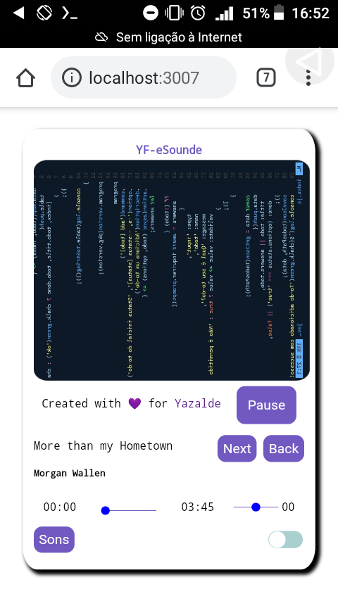
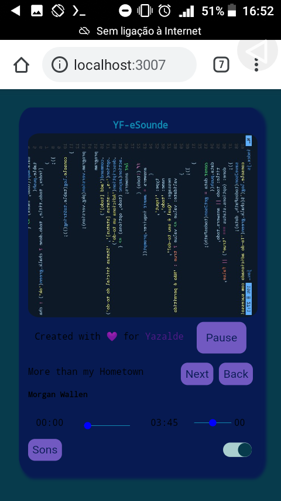
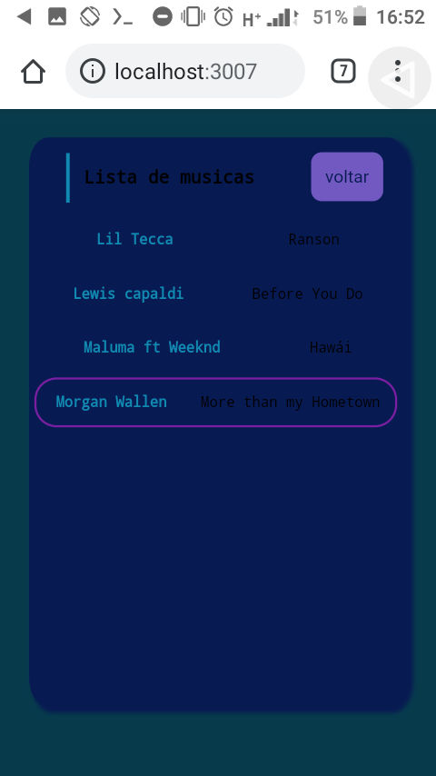

# eSound 🤓😜

**V1.0.0**

    

O que e eSound?

> E um leitor de música desenvolvido em JavaScript HTML CSS.

**Actualização V1.1.0**

    

**Actualização V2.1.0**

    

    
    

##### como usar?
      pkg install nodejs
##### Instale o Git
      pkg install git
##### clone o repositório
      git clone https://github.com/yazaldefilimonepinto/eSound

##### Entre a pasta no eSound
      cd eSound

##### Executi o npm/yarn
      mpm install
      yarn add

#### Levante o servidor
     node index.js

###😜🤓 ve o meu projeto com este [link](https://yazaldefilimonepinto.github.io/eSound/)

**Created with 💙 by  [Yazalde Felimone](https://www.linkedin.com/in/yazalde-filimone-65142b206)**
